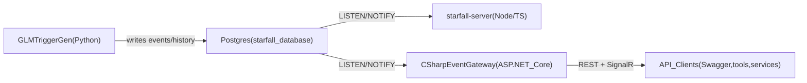

# C# StarFall Event Gateway – SRS, PRD, and Implementation Plan

### Executive summary (interview-facing)

**StarFall Event Gateway** is a standalone **ASP.NET Core** service that exposes a clean, documented **REST API** and **SignalR real-time stream** over StarFall’s existing Postgres database. It is designed to be adoptable with minimal friction: strong DTO contracts, background LISTEN/NOTIFY integration, health endpoints, and production-minded architecture (separation of concerns, logging, validation, resiliency).

**Why it’s valuable**: StarFall’s current Node/Socket.IO server mixes concerns (serving UI + DB access + real-time + service messaging). This gateway cleanly separates the “data + notifications API” into a maintainable .NET service that enables new clients (tools, dashboards, internal services) and future modernization.

**MVP deliverables for a compelling interview demo**:

- Swagger-documented REST endpoints:
  - `GET /health`
  - `GET /api/events`
  - `GET /api/events/{eventId}`
  - `GET /api/events/{eventId}/history`
- Health endpoint includes DB connectivity checks.
- Structured logs for request handling and DB connectivity.

**Stretch goals (if time)**:

- SignalR hub broadcasting event updates when Postgres notifications fire.
- Postgres LISTEN/NOTIFY background worker with reconnect/backoff.

### Repository and folder layout (explicit)

- **Project root folder**: `SpaceDynamixInterview/CSharpGatewayForSDLsStarFall/` (you will initialize this folder as its **own git repository**).
- **On-disk path (this machine)**: `C:\School\Interview\SpaceDynamixInterview\CSharpGatewayForSDLsStarFall\` (this is the repo root; all new code for the gateway lives here).
- **Relationship to StarFall repo**: the gateway is **not** implemented inside `StarFall/StarFall/`; it is a separate service that connects to StarFall’s database over the network.
- **Explicit API structure**: **Controllers** (not “pure minimal API”). Routes live in controller files under `Api/Controllers/` and delegate into services.

#### Planned repository tree (files we will create)

This is the concrete folder/file layout inside `C:\School\Interview\SpaceDynamixInterview\CSharpGatewayForSDLsStarFall\`.

```text
CSharpGatewayForSDLsStarFall/
  README.md
  plan.md
  .gitignore
  Starfall.EventGateway.sln
  src/
    Starfall.EventGateway.Api/
      Starfall.EventGateway.Api.csproj
      Program.cs
      appsettings.json
      appsettings.Development.json
      Controllers/
        HealthController.cs
        EventsController.cs
    Starfall.EventGateway.Application/
      Starfall.EventGateway.Application.csproj
      Abstractions/
        IEventService.cs
      Services/
        EventService.cs
    Starfall.EventGateway.Data/
      Starfall.EventGateway.Data.csproj
      Abstractions/
        IDbConnectionFactory.cs
        IEventRepository.cs
      Npgsql/
        NpgsqlConnectionFactory.cs
      Repositories/
        EventRepository.cs
      Sql/
        EventSql.cs
  tests/
    Starfall.EventGateway.Tests/
      Starfall.EventGateway.Tests.csproj
      EventRepositoryTests.cs
```

### 1. Product Requirements Document (PRD)

#### 1.1 Problem statement

StarFall currently uses a TypeScript/Express + Socket.IO server to serve the Vue viewer, query Postgres, and relay database notifications. This layer is tightly coupled to its current client technology and mixes responsibilities (serving static files, DB access, real-time messaging, microservice messaging). For an intern project, we will design a **standalone C# backend** that exposes a clear, documented API to StarFall data and real-time updates, making it easier to build new clients and to maintain the backend.

#### 1.2 Goals

- **G1 – Clean C# API layer**: Provide a small but well-architected ASP.NET Core backend for StarFall data.
- **G2 – Standalone & adoptable**: Run independently from the existing Node server; expose REST + SignalR endpoints that can be adopted by other teams without viewer changes.
- **G3 – Respect existing domain**: Use terminology and shapes aligned with existing StarFall concepts (events, event history, platforms/sensors) but not tightly coupled to Vue/Socket.IO.
- **G4 – Demonstrable in an interview**: Have a runnable service with Swagger, a basic SignalR hub, and at least one end-to-end flow that can be walked through.

#### 1.3 Non-goals

- Re-implementing or replacing the **Python GLM Trigger Generator**.
- Rebuilding the **StarFall viewer** in C#.
- Serving or replacing `starfall-viewer` (no MVC/Blazor UI in this project; backend gateway only).
- Implementing every existing topic, filter, or UI feature (we will pick a core subset and design for extensibility).

#### 1.4 Target users

- **Developers / interns**: Using the project to demonstrate C# backend skills.
- **Future StarFall maintainers**: Could adopt pieces or patterns from this gateway for production services.

#### 1.5 High-level features

- **F1 – REST API**
  - `GET /api/events` – paged list of events (summaries).
  - `GET /api/events/{eventId}` – detailed view of a single event.
  - `GET /api/events/{eventId}/history` – chronological history entries.
  - (Optional stretch) `GET /api/platforms` – list of platforms and sensors.

- **F2 – Real-time notifications via SignalR**
  - Hub that broadcasts when events are inserted/updated (`EventUpdated`, `EventCreated`).
  - Driven by Postgres LISTEN/NOTIFY on the same channels used today.

- **F3 – Operational endpoints**
  - `GET /health` – DB connectivity and basic liveness.
  - (Optional stretch) `GET /metrics` or simple in-memory stats (e.g., last notification time).

- **F4 – Documentation and examples**
  - Auto-generated Swagger/OpenAPI for REST.
  - A short README describing endpoints, DTOs, and how it maps to existing StarFall concepts.

#### 1.6 Success criteria

- Service runs locally, connects to a StarFall-style Postgres instance, and returns **real data** from at least `starfall_db_schema.events` and `starfall_db_schema.history`.
- At least one **SignalR client** successfully receives an update upon a DB notification.
- Codebase is **modular and readable**: clear separation of API, application, and data access concerns.

---

### 2. Software Requirements Specification (SRS)

#### 2.1 System context



The C# Event Gateway is a consumer of the existing StarFall database and its notification channels. It does not write to GLM inputs or control the GLM trigger generator; it exposes a clean API and notification surface for clients.

#### 2.1.1 Compatibility and adoption stance

- **Standalone**: runs independently from `starfall-server`; no changes required to the existing StarFall stack.
- **Adoptable**: uses idiomatic .NET patterns (DI, options/config, hosted services) so a C# team can pick it up quickly.
- **Contracts-first**: DTOs and hub messages are explicit and documented; REST remains the source of truth.

#### 2.2 Functional requirements

**FR1 – Retrieve paged event summaries**

- **Description**: Client can request a paged list of events ordered by approximate trigger time or last update.
- **Endpoint**: `GET /api/events?pageNumber={int}&pageSize={int}`
- **Input constraints**:
  - `pageNumber >= 0`, `pageSize > 0`, reasonable upper bound (e.g., 200).
- **Output**:
  - Paged result including `data: EventSummaryDto[]`, `totalCount`, `pageNumber`, `pageSize`.
- **Source tables (from existing TS handler)**: `starfall_db_schema.events`.

**FR2 – Retrieve a single event’s details**

- **Endpoint**: `GET /api/events/{eventId}`
- **Behavior**:
  - If `eventId` exists: return detailed information (event metadata and optionally sightings/light curves in a simplified form).
  - If not: return HTTP 404.
- **Source tables**: `events`, `sightings`, `point_sources`, `light_curves` (simplified subset is acceptable).

**FR3 – Retrieve event history**

- **Endpoint**: `GET /api/events/{eventId}/history`
- **Behavior**:
  - Return list of history entries (`time`, `entry`, `author`, etc.) for that event ordered by time.
  - If no event or no history exists, return 404 or empty list depending on implementation choice (documented).
- **Source tables**: `starfall_db_schema.history`.

**FR4 – Real-time event updates via SignalR**

- **Hub route**: e.g., `/hubs/events`
- **Hub methods / messages**:
  - Server-to-client:
    - `EventUpdated(EventSummaryDto event)` – raised when an existing event’s processing state or key properties change.
    - `EventCreated(EventSummaryDto event)` – raised when a new event is inserted.
  - Client-to-server: optional/no-op for MVP; clients just subscribe.
- **Trigger source**:
  - Postgres `LISTEN` on `processing_state_changed` and `new_event_insert` channels (names aligned with `topics.ProcessingStateChanged` and `topics.NewEventInsert`).

**FR5 – Health check**

- **Endpoint**: `GET /health`
- **Behavior**:
  - Returns 200 if the service is running and can successfully open a Postgres connection.
  - Payload can include `dbConnected: bool`, `lastNotificationTime: DateTime?`.

**FR6 – Configuration**

- DB connection string, LISTEN channels, and logging settings are configurable via `appsettings.json` and/or environment variables, mirroring the pattern used in `starfall-server/src/config.ts` but in idiomatic .NET.

#### 2.2.1 REST API specification (MVP)

**Common conventions**

- **Base path**: `/api`
- **Media type**: `application/json`
- **Time format**: ISO-8601 `DateTimeOffset` in UTC in responses
- **Paging**: `pageNumber` is 0-based

**GET `/api/events`**

- **Query params**
  - `pageNumber` (default `0`, min `0`)
  - `pageSize` (default `25`, min `1`, max `200`)
  - (Optional stretch) `sort` in `{triggerTimeAsc,triggerTimeDesc,energyAsc,energyDesc,stateAsc,stateDesc}`
- **200 response**: `PagedResult<EventSummaryDto>`
- **400 response**: validation problem details (invalid paging)

**GET `/api/events/{eventId}`**

- **200 response**: `EventDetailsDto`
- **404 response**: not found (event doesn’t exist)
- **400 response**: invalid GUID

**GET `/api/events/{eventId}/history`**

- **200 response**: `EventHistoryItemDto[]` ordered ascending by time
- **404 response**: event not found (preferred for clarity)

**GET `/health`**

- **200 response**: `HealthDto` with DB connectivity + last notification time
- **503 response**: unhealthy (cannot connect to DB)

#### 2.2.2 SignalR specification (MVP)

**Hub**: `/hubs/events`

**Server-to-client messages**

- `EventCreated(EventSummaryDto event)`
- `EventUpdated(EventSummaryDto event)`
- (Optional stretch) `HistoryUpdated(Guid eventId, EventHistoryItemDto[] history)`

**Client-to-server messages**

- None required for MVP

**Delivery semantics**

- Best-effort real-time notifications; clients should treat REST as the source of truth.

#### 2.3 Non-functional requirements

- **NFR1 – Maintainability**: Clear separation of layers (API, application, data access). No business logic in controllers/endpoints.
- **NFR2 – Performance**: Paging must use SQL `LIMIT`/`OFFSET` and appropriate indexes; no loading of entire event tables into memory.
- **NFR3 – Reliability**: Background listener should be resilient to transient DB failures (reconnect loop with backoff).
- **NFR4 – Security (scoped for demo)**: For interview/demo, anonymous access is acceptable; design should leave room for future auth (e.g., JWT or API key) without major refactor.
- **NFR5 – Observability**: Log key events (startup, DB connection failures, notification handling errors) using ASP.NET Core logging abstractions.

#### 2.3.1 Non-functional acceptance criteria (interview-grade)

- **Latency**: `/api/events` returns in a reasonable time on local DB for typical page sizes (target <500ms for `pageSize <= 50`).
- **Resiliency**: if Postgres restarts, the LISTEN/NOTIFY background service reconnects without manual intervention.
- **Code quality**: explicit DTOs; no ad-hoc anonymous objects in API responses.
- **Docs**: Swagger shows endpoint summaries, parameter descriptions, and response codes.
- **Observability**: structured logs show notification receipt, event reload, and broadcast success/failure.

#### 2.4 Data model (logical view for this service)

Focus on a **subset** of the StarFall schema:

- `events` (core fields: id, times, energy, state, location_ecef, velocity_ecef, user_viewed, parent_id).
- `history` (history_id, time, entry, author, event_id).
- (Optional) `platforms`, `sensors`, `sightings` for a later endpoint.

Map to DTOs:

- `EventSummaryDto`
  - `Guid EventId`
  - `DateTimeOffset ApproxTriggerTime`
  - `double? ApproxEnergyJ`
  - `int ProcessingState`
  - `bool UserViewed`
  - `double? LatitudeDeg`, `double? LongitudeDeg`, `double? AltitudeM` (derived from existing location data or null)

- `EventDetailsDto`
  - `EventSummaryDto Summary`
  - `IReadOnlyDictionary<string, PointSourceDto[]> Sightings` (optional initial implementation can be `null` or minimal).

- `EventHistoryItemDto`
  - `Guid HistoryId`
  - `Guid EventId`
  - `DateTimeOffset Time`
  - `string Entry`
  - `string Author`

- `PagedResult<T>`
  - `IReadOnlyList<T> Data`
  - `int TotalCount`
  - `int PageNumber`
  - `int PageSize`

#### 2.4.1 DTO definitions (MVP contract)

These DTOs are the interview-facing contract. Keep them stable and versionable.

- `EventSummaryDto`
  - `Guid eventId`
  - `DateTimeOffset approxTriggerTime`
  - `DateTimeOffset createdTime`
  - `DateTimeOffset lastUpdateTime`
  - `int processingState`
  - `bool userViewed`
  - `double? approxEnergyJ`
  - `double? latitudeDeg`
  - `double? longitudeDeg`
  - `double? altitudeM`
  - `double[]? locationEcefM` (length 3 or null)
  - `double[]? velocityEcefMSec` (length 3 or null)

- `EventDetailsDto`
  - `EventSummaryDto summary`
  - (Optional MVP+) `Dictionary<string, PointSourceDto[]> sightings`
  - (Optional MVP+) `Dictionary<string, LightCurveDto[]> lightCurves`

- `EventHistoryItemDto`
  - `Guid historyId`
  - `Guid eventId`
  - `DateTimeOffset time`
  - `string entry`
  - `string author`

- `PagedResult<T>`
  - `IReadOnlyList<T> data`
  - `int totalCount`
  - `int pageNumber`
  - `int pageSize`

- `HealthDto`
  - `string status` in `{Healthy,Unhealthy}`
  - `bool dbConnected`
  - `DateTimeOffset? lastNotificationTime`

#### 2.4.2 Data transformations (important for clean clients)

- StarFall’s current viewer converts epoch seconds to milliseconds on the client (see `starfall-viewer/src/SocketIO/Handlers/DatabaseHandler.ts`). This gateway will return **proper timestamps** (`DateTimeOffset`) so clients don’t repeat conversion logic.
- If ECEF-to-lat/lon/alt conversion is too time-consuming for MVP, return `locationEcefM` and keep `latitudeDeg/longitudeDeg/altitudeM` nullable; document this as a planned enhancement.

#### 2.5 Technology decisions

- **API style (explicit)**: **Controllers**. Endpoints live under `Api/Controllers/*.cs` and delegate into `Application/*` services (no SQL inside controllers).
- **Data access**: Use **Dapper + Npgsql** for the MVP. This keeps the implementation small, explicit, and low-risk for an interview timeline while still producing clean DTO contracts. If the model grows, EF Core can be introduced later behind the same repository interface.
- **Real-time**: ASP.NET Core **SignalR**.
- **Database driver**: Npgsql.

#### 2.5.1 Recommended solution structure (maintainability)

- `src/Starfall.EventGateway.Api/`
  - `Controllers/` (Controllers only; attribute routing; thin)
  - `Program.cs` (composition root)
  - `appsettings*.json`
- `src/Starfall.EventGateway.Application/`
  - services/use-cases, validation, mapping to DTOs
- `src/Starfall.EventGateway.Data/`
  - repositories, SQL strings, connection factory (`NpgsqlConnection`)
- `src/Starfall.EventGateway.Contracts/` (optional but interview-friendly)
  - DTOs and shared contracts (REST + SignalR payload types)
- `tests/Starfall.EventGateway.Tests/` (lightweight tests)

---

### 3. Implementation plan (step-by-step)

#### 3.0.1 Incremental task breakdown (AI-safe “small bites”)

We will implement the gateway in tiny, low-risk steps. Each step should be small enough to review quickly and verify before moving on.

**Phase A – Boot + health (no DB queries yet)**

- **A1** Create solution + projects:
  - `Starfall.EventGateway.sln`
  - `src/Starfall.EventGateway.Api/Starfall.EventGateway.Api.csproj`
  - `src/Starfall.EventGateway.Application/Starfall.EventGateway.Application.csproj`
  - `src/Starfall.EventGateway.Data/Starfall.EventGateway.Data.csproj`
- **A2** Wire up `src/Starfall.EventGateway.Api/Program.cs`:
  - Add Controllers
  - Enable Swagger
- **A3** Add `src/Starfall.EventGateway.Api/Controllers/HealthController.cs` with `GET /health` returning a basic payload (no DB yet).

**Phase B – DB connectivity**

- **B0** Remove template/hardcoded API endpoints (delete `WeatherForecastController.cs` and `WeatherForecast.cs`) so every remaining endpoint is either DB-backed or intentionally part of the gateway scope.
- **B1** Add `src/Starfall.EventGateway.Api/appsettings.json` + `appsettings.Development.json` with a `ConnectionStrings:StarfallDatabase`.
- **B2** Add `src/Starfall.EventGateway.Data/Abstractions/IDbConnectionFactory.cs`.
- **B3** Add `src/Starfall.EventGateway.Data/Npgsql/NpgsqlConnectionFactory.cs` and register it in `src/Starfall.EventGateway.Api/Program.cs`.
- **B4** Update `HealthController.cs` to check DB connectivity (open connection + simple `SELECT 1`).

**Phase C – First real endpoint (event list)**

- **C1** Add DTOs (either in `Api/Models/` or `Contracts/` if you choose to add that project):
  - `EventSummaryDto`
  - `PagedResult<T>`
- **C2** Add SQL constants in `src/Starfall.EventGateway.Data/Sql/EventSql.cs` (paged event list + total count).
- **C3** Add `src/Starfall.EventGateway.Data/Abstractions/IEventRepository.cs`.
- **C4** Add `src/Starfall.EventGateway.Data/Repositories/EventRepository.cs` implementing the event list query with Dapper.
- **C5** Add `src/Starfall.EventGateway.Application/Abstractions/IEventService.cs` + `src/Starfall.EventGateway.Application/Services/EventService.cs` for the list endpoint.
- **C6** Add `src/Starfall.EventGateway.Api/Controllers/EventsController.cs` implementing `GET /api/events` + paging validation.

**Phase D – Event details + history**

- **D1** Add DTOs:
  - `EventDetailsDto` (start with `summary` only)
  - `EventHistoryItemDto`
- **D2** Add SQL to `src/Starfall.EventGateway.Data/Sql/EventSql.cs` for:
  - single event by id
  - event history by event id
- **D3** Extend `IEventRepository.cs` + `EventRepository.cs` with methods for details + history.
- **D4** Extend `IEventService.cs` + `EventService.cs` with details + history methods (including 404 behavior).
- **D5** Extend `EventsController.cs` with:
  - `GET /api/events/{eventId}`
  - `GET /api/events/{eventId}/history`

**Phase E – Optional “wow” real-time**

- **E1** Add SignalR hub in `src/Starfall.EventGateway.Api/Hubs/EventHub.cs` and map it in `Program.cs`.
- **E2** Add a Postgres LISTEN/NOTIFY background service in `src/Starfall.EventGateway.Api/HostedServices/PostgresNotificationListener.cs`.

**Phase F – Polish**

- **F1** Improve Swagger descriptions + response codes (attributes + XML docs as needed).
- **F2** Add structured logging for request timing + DB errors + (stretch) notification handling.
- **F3** Update `README.md` with a demo script + curl examples + how to run against StarFall DB.

#### 3.0.2 Detailed next steps to integrate with StarFall’s full database (post-MVP)

After the interview MVP works (events + history), expand integration in small slices. The goal is to integrate with the full StarFall DB **without** turning the gateway into a risky “big bang” rewrite.

**I. Inventory and document schema (source of truth)**

- Use StarFall DB migrations to catalog tables and relationships: `StarFall/StarFall/starfall-database/startup_scripts/migrations/*.sql`.
- Produce a short schema note for the gateway repo: tables, keys, and which endpoints use them.

**II. Expand repository coverage one endpoint at a time**

- Add one new repository method per endpoint, each backed by explicit SQL and mapped into DTOs (do not return raw DB rows).

Suggested order (matches existing StarFall viewer/server usage patterns):

- Platforms & sensors: `platforms`, `sensors`
- Sightings by `event_id`: `sightings`
- Point sources + tags for drill-down: `point_sources` + `tags`
- Light curves: `light_curves` (may require special handling if binary/proto encoded)

**III. Add endpoints without breaking existing contracts**

- Keep `/api/events*` stable; add new resources under `/api/` with consistent naming.
- Introduce versioning only when needed (e.g., `/api/v1/...` once you expect breaking changes).

**IV. Real-time parity (LISTEN/NOTIFY)**

- Add DB channels incrementally (already in StarFall): `new_history_insert`, etc.
- Broadcast SignalR events corresponding to DB changes (keep payloads small; REST is source of truth).

**V. Production-readiness upgrades (if adopted)**

- Auth (API key or JWT) behind a feature flag.
- OpenTelemetry tracing/metrics.
- CI pipeline (build + test + lint) in the gateway repository.

**VI. Rollout plan**

- Run gateway in parallel with existing `starfall-server`.
- Start with read-only endpoints used by internal tools; expand client adoption gradually.

#### 3.0 Milestones (interview-oriented)

- **M1 (Core REST)**: `/health`, `/api/events`, `/api/events/{id}`, `/api/events/{id}/history` working + Swagger polished.
- **M2 (Ops polish)**: structured logging, consistent error responses, DB connectivity + timeouts.
- **M3 (Stretch: real-time)**: SignalR hub + Postgres LISTEN/NOTIFY broadcasts `EventUpdated`/`EventCreated`.
- **M4 (Demo artifacts)**: short README + curl examples + (optional) tiny SignalR console client.

#### 3.1 Project skeleton

- Create a new ASP.NET Core Web API project (e.g., `Starfall.EventGateway`).
- Add references/packages:
  - `Npgsql` + `Dapper` for DB access.
  - `Microsoft.AspNetCore.SignalR` / `Microsoft.AspNetCore.SignalR.Core`.
  - `Swashbuckle.AspNetCore` for Swagger.
- Set up `Program.cs` / `Startup` with:
  - Controllers + attribute routing.
  - SignalR hub registration (e.g., `app.MapHub<EventHub>("/hubs/events")`).
  - Swagger in development.

#### 3.2 Configuration & infrastructure

- Add `appsettings.json` with:
  - `ConnectionStrings:StarfallDatabase`.
  - Settings section for LISTEN channels, command timeout, etc.
- Register a typed `IDbConnectionFactory` or equivalent to create Npgsql connections.
- Implement a simple `HealthService` that checks DB connectivity.

#### 3.3 Data access layer (using Dapper)

- Implement `IEventRepository` with methods:
  - `Task<PagedResult<EventSummaryDto>> GetEventsAsync(int pageNumber, int pageSize, CancellationToken ct)`.
  - `Task<EventDetailsDto?> GetEventDetailsAsync(Guid eventId, CancellationToken ct)`.
  - `Task<IReadOnlyList<EventHistoryItemDto>> GetEventHistoryAsync(Guid eventId, CancellationToken ct)`.
- Use explicit SQL inspired by `starfall-server/src/Messaging/Handlers/DataBaseHandler.ts`, trimmed to MVP fields.
- Ensure all queries are parameterized, async, and cancellation-aware.
- Keep SQL in a single location (e.g., repository file or `Data/Sql/` constants) to keep it easy to review.

#### 3.4 Application layer (services)

- Implement `IEventService` that composes repository results into DTOs and enforces any business rules (e.g., 404 vs empty list for history).
- Optionally handle simple transformations (e.g., converting epoch seconds to `DateTimeOffset`, computing lat/lon/alt from ECEF if you mirror existing helpers or stub with null for MVP).

#### 3.5 API layer (controllers)

- `EventsController`:
  - `GET /api/events` → uses `IEventService.GetEventsAsync` with query params.
  - `GET /api/events/{id}` → uses `IEventService.GetEventDetailsAsync`, returns 404 when null.
  - `GET /api/events/{id}/history` → uses `IEventService.GetEventHistoryAsync`.
- `HealthController`:
  - `GET /health` → uses `HealthService` and returns a simple status object.

#### 3.6 Stretch: SignalR event hub & background listener (optional)

- Create `EventHub : Hub` with no mandatory client-to-server methods.
- Implement `PostgresNotificationListener : BackgroundService`:
  - On start, open Npgsql connection and execute:
    - `LISTEN processing_state_changed;`
    - `LISTEN new_event_insert;`
  - In the loop, when a notification arrives:
    - Parse the payload to obtain `event_id` and state.
    - Use `IEventService` to load an `EventSummaryDto`.
    - Use `IHubContext<EventHub>` to broadcast `EventUpdated` or `EventCreated`.
  - Implement reconnection logic on failures.

#### 3.7 Testing & validation

- Unit tests for:
  - SQL mapping of one or two repository methods (using an in-memory or test DB if feasible).
  - `EventService` behavior (404 logic, paging, etc.).
- Manual tests:
  - Run service against the StarFall database container.
  - Hit Swagger docs to exercise `GET /api/events` and `GET /api/events/{id}`.
  - (Stretch) Manually insert/update an event row (or simulate a notification) and verify the SignalR client receives `EventUpdated`.

#### 3.8 Documentation & interview preparation

- Write a short `README.md` for the C# project:
  - What problem it solves relative to StarFall.
  - How to run it (connection string, command).
  - Summary of endpoints and SignalR hub events.
- Prepare talking points:
  - Why Dapper was chosen for this slice of the data model, and how EF Core could be introduced later.
  - How the gateway fits alongside, not inside, the existing StarFall monorepo.
  - How you would extend it (filters, auth, more topics) if given more time.

#### 3.9 Demo script (what to show live in the interview)

- Start the StarFall Postgres container (or point to an existing StarFall DB).
- Use `StarFall/StarFall/mock-event-emitter` as a demo driver to insert mock events into Postgres and validate the gateway’s REST responses (and SignalR updates if stretch is implemented).
- Start the C# gateway and show startup logs:
  - DB connection established
  - LISTEN channels subscribed
- Open Swagger:
  - Call `GET /api/events`
  - Pick an `eventId` and call `GET /api/events/{eventId}` and `GET /api/events/{eventId}/history`
- Start a SignalR test client (console app is enough):
  - Connect to `/hubs/events`
  - Show receiving `EventUpdated`/`EventCreated` when Postgres sends notifications
  - (Optional) After receiving an update, fetch the updated event via REST to show REST as source of truth

#### 3.10 Presentation plan (10-minute deck; after build)

The committee requested a presentation ≤10 minutes with (1) an intro slide and (2) two or more slides sharing C#-related projects. This project will be presented as two C# deliverables within the same repository:

- **DeliverableA: StarFallEventGateway(API)**: the REST gateway service (Controllers + Services + Dapper repositories).
- **DeliverableB: OpsAndIntegrationHarness**: health/readiness, DB connectivity, demo driver usage (`mock-event-emitter`), and (stretch) realtime notifications.

**Slide plan (5–6 slides)**

- **Slide1_Intro**: who I am, what I like building, what I’ll present.
- **Slide2_DeliverableA_Business**: problem, goals, business value, MVP scope.
- **Slide3_DeliverableA_Technical**: system context diagram, REST endpoints, DTO contract.
- **Slide4_DeliverableB_OpsIntegration**: `/health`, logs, test strategy, rollout plan (parallel with `starfall-server`).
- **Slide5_DemoOrResults**: Swagger screenshots + example JSON responses (or quick live demo if allowed).
- **Slide6_WrapUp**: next steps + questions.

**What to email the night before**

- Attach **PDF** and **.pptx** (no cloud links), per interview instructions.